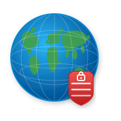

# traefik-geoblock-plugin



[](https://github.com/leardev/traefik-geoblock-plugin/actions/workflows/ci.yml)
[](https://goreportcard.com/report/github.com/leardev/traefik-geoblock-plugin)
[](https://app.codecov.io/gh/leardev/traefik-geoblock-plugin)

A [Traefik](https://traefik.io/) middleware plugin that blocks or allows requests based on geographic location, using the [IPInfo Lite](https://ipinfo.io/products/free-ip-database) database with automatic updates.

## Features

- **Allowlist or blocklist** mode via country codes (ISO 3166-1 alpha-2)
- **Automatic database updates** on a configurable interval
- **Private/reserved IP handling** — optionally pass through RFC1918 and loopback addresses
- **Configurable fallback** when an IP is not found in the database
- **Custom HTTP status code** for blocked requests (default: `403`)
- **Optional request logging**
- **Country header** — write `X-Geoblock-Country` and `X-Geoblock-City` on every response for visibility in Traefik access logs

## Installation

Add the plugin to your Traefik static configuration:

```yaml
experimental:
  plugins:
    geoblock:
      moduleName: github.com/leardev/traefik-geoblock-plugin
      version: v0.1.9
```

### Traefik 3.5+ — unsafe (local) plugin mode

Traefik 3.5 introduced *unsafe* plugin loading, which allows running plugins directly from a local directory without going through the Plugin Catalog. This is useful for self-hosted setups or forks:

```yaml
# traefik.yml (static config)
experimental:
  localPlugins:
    geoblock:
      moduleName: github.com/leardev/traefik-geoblock-plugin

# Mount the plugin source into the Traefik container:
# /plugins-local/src/github.com/leardev/traefik-geoblock-plugin/
```

> **Note:** Local/unsafe plugins are not signed or vetted by Traefik Labs. Only load plugin source you trust.

For local development, use `localPlugins` instead (see [test/docker-compose.yml](test/docker-compose.yml)).

## Configuration

### Database backends

The plugin supports two database backends. Set **either** `databaseMMDBPath` (MMDB, default) **or** `databasePath` (CSV) — not both.

| Backend | Config key | Default path | Memory usage |
|---------|-----------|--------------|-------------|
| MMDB `.mmdb` | `databaseMMDBPath` | `/tmp/ipinfo_lite.mmdb` | ~50 MB heap per replica |
| CSV `.csv.gz` | `databasePath` | *(none)* | ~150 MB heap per replica |

The MMDB backend is recommended for production and multi-replica deployments.

### All options

| Option               | Type       | Default                     | Description                                                       |
|----------------------|------------|-----------------------------|-------------------------------------------------------------------|
| `allowedCountries`   | `[]string` | —                           | Allowlist of country codes. Mutually exclusive with `blockedCountries`. |
| `blockedCountries`   | `[]string` | —                           | Blocklist of country codes. Mutually exclusive with `allowedCountries`. |
| `token`              | `string`   | **required**                | IPInfo API token for downloading the database.                    |
| `databaseMMDBPath`   | `string`   | `/tmp/ipinfo_lite.mmdb`     | Path to cache the MMDB database. Mutually exclusive with `databasePath`. |
| `databaseMMDBURL`    | `string`   | *(IPInfo MMDB URL)*         | Override the MMDB download URL (testing only).                    |
| `databasePath`       | `string`   | —                           | Path to cache the gzipped CSV database. When set, the CSV backend is used. Mutually exclusive with `databaseMMDBPath`. |
| `databaseURL`        | `string`   | *(IPInfo CSV URL)*          | Override the CSV download URL (testing only).                     |
| `updateInterval`     | `int`      | `24`                        | Hours between automatic database refreshes.                       |
| `allowPrivate`       | `bool`     | `true`                      | Pass through requests from private/reserved IP ranges.            |
| `defaultAllow`       | `bool`     | `true`                      | Allow requests when the IP is not found or the DB is not loaded.  |
| `httpStatusCode`     | `int`      | `403`                       | HTTP status code returned for blocked requests.                   |
| `logEnabled`         | `bool`     | `false`                     | Log each allowed/blocked decision.                                |
| `addCountryHeader`   | `bool`     | `false`                     | Write an `X-Geoblock-Country` response header with the resolved country code, and (MMDB backend only) an `X-Geoblock-City` header with the city name, on every request (see [Access log visibility](#access-log-visibility)). |

Exactly one of `allowedCountries` or `blockedCountries` must be set.

## Example dynamic configuration

### MMDB backend (recommended)

```yaml
http:
  middlewares:
    my-geoblock:
      plugin:
        geoblock:
          allowedCountries:
            - DE
            - AT
            - CH
          token: "your-ipinfo-token"
          databaseMMDBPath: "/data/ipinfo_lite.mmdb"
          updateInterval: 24
          allowPrivate: true
          defaultAllow: false
          logEnabled: true
```

### CSV backend (higher RAM usage)

```yaml
http:
  middlewares:
    my-geoblock:
      plugin:
        geoblock:
          allowedCountries:
            - DE
            - AT
            - CH
          token: "your-ipinfo-token"
          databasePath: "/data/ipinfo_lite.csv.gz"
          updateInterval: 24
          allowPrivate: true
          defaultAllow: false
          logEnabled: true
```

## Access log visibility

Traefik's access log shows the HTTP status code but not *why* a request was blocked. Enable `addCountryHeader: true` to write an `X-Geoblock-Country` response header on every request (plus `X-Geoblock-City` when using the MMDB backend), then tell Traefik to include them in access log lines.

**Plugin config:**
```yaml
http:
  middlewares:
    my-geoblock:
      plugin:
        geoblock:
          addCountryHeader: true
          # ... other options
```

**Traefik static config:**
```yaml
accessLog:
  fields:
    headers:
      defaultMode: drop
      names:
        X-Geoblock-Country: keep
        X-Geoblock-City: keep
```

Blocked access log lines will then include the country (and city, if available) that triggered the block:

```
"GET / HTTP/1.1" 403 ... "X-Geoblock-Country: CN" "X-Geoblock-City: Shanghai"
```

**Header values:**

| Header | Value | Meaning |
|---|---|---|
| `X-Geoblock-Country` | `DE`, `US`, … | Resolved 2-letter country code |
| `X-Geoblock-Country` | `unknown` | IP not found in the database |
| `X-Geoblock-Country` | `private` | Request from a private / RFC 1918 address |
| `X-Geoblock-Country` | `db-not-loaded` | Database not yet downloaded |
| `X-Geoblock-City` | `Berlin`, … | City name (MMDB backend only; omitted when not available) |

> The header is set on *all* requests — allowed and blocked alike — so it can also be used for metrics or access log analysis, not just debugging 403s.

## Local testing

> **Note:** The Docker Compose setup in `test/` is for integration testing only, not for production use.

```bash
IPINFO_TOKEN=your-token docker compose -f test/docker-compose.yml up
```

Traefik will be available at `http://localhost:80` and the dashboard at `http://localhost:8080`.

## License

MIT
